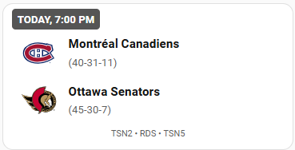
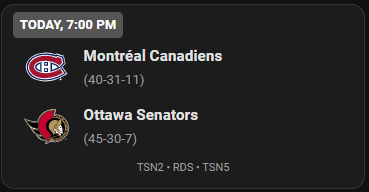
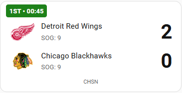
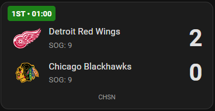
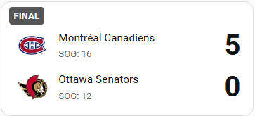
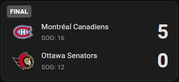

# NHL Score Card

A custom Lovelace card for Home Assistant that displays NHL scores using the [hass-nhlapi](https://github.com/JayBlackedOut/hass-nhlapi) custom integration.

## Installation (HACS)

1. Go to HACS → Frontend → Custom repositories.
2. Add this repo URL as type **Lovelace**.
3. Install **NHL Score Card**.
4. Add the following resource in your Lovelace configuration:

```yaml
resources:
  - url: /hacsfiles/nhl-score-card/nhl-score-card.js
    type: module
```

## Examples
Light/dark mode follows the mode set in Home Assistant's settings.

### Game is scheduled:





### Game is live:





### Game has ended:



